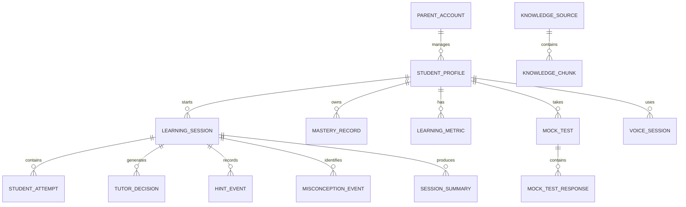

# LearnFirst AI — Database & Learning State Design

**Document ID:** LF-DBS-001  
**Version:** 1.0  
**Status:** Initial Data Architecture Specification  
**Project:** LearnFirst AI  
**Primary Users:** Children aged 7–14  
**Secondary Users:** Parents  
**Primary Context:** Bangladesh-aligned, English-language learning  
**Specialized Subjects:** Mathematics, English, Science  
**Additional Support:** General Guided Learning  

---

# 1. Purpose

This document defines how LearnFirst AI will store and manage:

- parent accounts;
- student profiles;
- learning sessions;
- student attempts;
- Tutor Policy decisions;
- hint usage;
- misconceptions;
- mastery state;
- learning-independence metrics;
- mock tests;
- voice-session metadata;
- RAG source metadata;
- parent access relationships;
- observability metadata.

The database must be designed around **learning state and educational progress**, not only raw chatbot messages.

The central design principle is:

> **Store only the data needed to provide safe, stateful, measurable learning support.**

---

# 2. Data Architecture Goals

The data layer should support:

1. persistent learning sessions;
2. progressive hint tracking;
3. misconception history;
4. mastery tracking by concept;
5. age-adaptive tutoring;
6. parent progress reporting;
7. answer-resistance evaluation;
8. subject-specific analytics;
9. privacy-aware storage;
10. migration from SQLite to PostgreSQL;
11. evaluation and observability;
12. future curriculum expansion.

---

# 3. Database Technology

## Development

Use:

```text
SQLite
```

Reasons:

- lightweight;
- easy local development;
- no additional database server;
- suitable for the current PC;
- works well with SQLAlchemy.

## Production Target

Use:

```text
PostgreSQL
```

Reasons:

- better concurrency;
- stronger production reliability;
- better indexing and analytics;
- easier future use of pgvector;
- suitable for deployment.

## Database Abstraction

Use:

```text
SQLAlchemy
+
Alembic
```

Application business logic should not depend on SQLite-specific behavior.

---

# 4. Main Data Domains

LearnFirst AI will store five broad categories of information.

## 4.1 Account Data

Used for authentication and parent access.

Examples:

```text
Parent account
Email
Password hash
Account status
Created date
```

## 4.2 Student Profile Data

Used for age adaptation and curriculum context.

Examples:

```text
Age
Grade
Age group
Preferred language
Curriculum profile
```

## 4.3 Learning State Data

Used for current tutoring behavior.

Examples:

```text
Current subject
Current topic
Current problem
Hint level
Attempt count
Misconception
Last tutor action
```

## 4.4 Learning Event Data

Used for progress tracking.

Examples:

```text
Attempts
Hints
Tutor decisions
Misconceptions
Mastery updates
Mock-test responses
```

## 4.5 Knowledge/System Data

Used for RAG, evaluation, and observability.

---

# 5. Core Entity Relationship Overview



---

# 6. Parent Account

Suggested table:

```text
parent_accounts
```

| Field | Type | Required | Purpose |
|---|---|---:|---|
| id | UUID/String | Yes | Primary key |
| email | String | Yes | Login identity |
| password_hash | String | Yes | Secure password storage |
| display_name | String | No | Parent display name |
| is_active | Boolean | Yes | Account status |
| created_at | DateTime | Yes | Creation time |
| updated_at | DateTime | Yes | Last update |

Important:

```text
Never store plain-text passwords.
```

---

# 7. Student Profile

Suggested table:

```text
student_profiles
```

| Field | Type | Required | Purpose |
|---|---|---:|---|
| id | UUID/String | Yes | Primary key |
| parent_id | FK | Yes | Parent ownership |
| display_name | String | Yes | Student-facing name |
| age | Integer | Yes | Age adaptation |
| grade | String | Yes | Learning context |
| age_group | Enum/String | Yes | Foundation / Developing / Independent |
| preferred_language | String | Yes | English initially |
| curriculum_profile | String | Yes | Bangladesh-English initially |
| created_at | DateTime | Yes | Creation time |
| updated_at | DateTime | Yes | Last update |

Recommended initial values:

```text
preferred_language = "en"
curriculum_profile = "bangladesh_english_v1"
```

---

# 8. Age Group Mapping

Age group should be determined by application logic.

```text
7–9   → FOUNDATION
10–12 → DEVELOPING
13–14 → INDEPENDENT
```

The LLM should not decide the learner's age group.

---

# 9. Learning Session

Suggested table:

```text
learning_sessions
```

| Field | Type | Required | Purpose |
|---|---|---:|---|
| id | UUID/String | Yes | Session ID |
| student_id | FK | Yes | Student |
| mode | Enum/String | Yes | Learn/Homework/Practice/Mock/Voice |
| subject | Enum/String | Yes | Math/English/Science/General |
| topic | String | No | Current topic |
| concept_code | String | No | Stable concept ID |
| current_problem | Text | No | Current learning task |
| current_hint_level | Integer | Yes | 0–7 |
| attempt_count | Integer | Yes | Attempts on current task |
| direct_answer_requests | Integer | Yes | Answer-seeking count |
| current_misconception | String | No | Current misconception |
| mastery_state | String | Yes | Session mastery state |
| last_tutor_action | String | No | Last Tutor Policy action |
| status | String | Yes | active/completed/abandoned |
| started_at | DateTime | Yes | Start time |
| ended_at | DateTime | No | End time |
| updated_at | DateTime | Yes | Last update |

---

# 10. Structured Session State

LearnFirst AI should not rely on conversation history alone.

Example state:

```json
{
  "mode": "homework_help",
  "subject": "math",
  "topic": "linear_equations",
  "concept_code": "MATH_ALG_LINEAR_01",
  "attempt_count": 2,
  "hint_level": 3,
  "direct_answer_requests": 1,
  "current_misconception": "inverse_multiplication",
  "skills_demonstrated": [
    "subtract_constant"
  ],
  "mastery_state": "learning",
  "last_tutor_action": "GIVE_HINT"
}
```

This structured state is more reliable and cheaper than resending unlimited raw chat history.

---

# 11. Student Attempts

Suggested table:

```text
student_attempts
```

| Field | Type | Required | Purpose |
|---|---|---:|---|
| id | UUID/String | Yes | Attempt ID |
| session_id | FK | Yes | Learning session |
| student_id | FK | Yes | Student |
| problem_ref | String | No | Problem identifier |
| response_text | Text | Yes | Student attempt |
| attempt_number | Integer | Yes | Attempt order |
| status | String | Yes | Correct/Partial/Incorrect/Incomplete/Unclear |
| is_independent | Boolean | Yes | Whether meaningful help was already given |
| hint_level_before | Integer | Yes | Assistance level before attempt |
| misconception_code | String | No | Detected issue |
| validator_result | JSON/Text | No | Math/tool validation |
| created_at | DateTime | Yes | Time |

---

# 12. Independent Attempt Definition

Initial rule:

```text
Hint Level 0–1
→ May count as Independent

Hint Level 2+
→ Assisted Attempt
```

This is an engineering definition for the prototype and should later be evaluated rather than treated as a validated educational standard.

---

# 13. Tutor Decisions

Suggested table:

```text
tutor_decisions
```

This is a critical table because it allows Tutor Policy behavior to be audited and evaluated.

| Field | Type | Required |
|---|---|---:|
| id | UUID/String | Yes |
| session_id | FK | Yes |
| student_id | FK | Yes |
| detected_intent | String | Yes |
| subject | String | Yes |
| attempt_status | String | No |
| selected_action | String | Yes |
| selected_hint_level | Integer | Yes |
| allow_final_answer | Boolean | Yes |
| requires_rag | Boolean | Yes |
| requires_validation | Boolean | Yes |
| requires_mastery_check | Boolean | Yes |
| policy_bypass_detected | Boolean | Yes |
| model_used | String | No |
| created_at | DateTime | Yes |

---

# 14. Hint Events

Suggested table:

```text
hint_events
```

| Field | Type | Required |
|---|---|---:|
| id | UUID/String | Yes |
| session_id | FK | Yes |
| student_id | FK | Yes |
| hint_level | Integer | Yes |
| hint_type | String | Yes |
| related_concept | String | No |
| created_at | DateTime | Yes |

Possible hint types:

```text
RECALL
GUIDING_QUESTION
SMALL_HINT
SIMILAR_EXAMPLE
DECOMPOSITION
STRONG_GUIDANCE
FULL_TEACHING
```

---

# 15. Misconception Events

Suggested table:

```text
misconception_events
```

| Field | Type | Required |
|---|---|---:|
| id | UUID/String | Yes |
| student_id | FK | Yes |
| session_id | FK | Yes |
| subject | String | Yes |
| topic | String | No |
| concept_code | String | No |
| misconception_code | String | Yes |
| description | Text | No |
| confidence | Float | No |
| resolved_in_session | Boolean | Yes |
| created_at | DateTime | Yes |

Example codes:

```text
MATH_INVERSE_OPERATION
MATH_DIVIDE_COEFFICIENT
MATH_FRACTION_DENOMINATOR
ENG_PAST_TENSE
ENG_SUBJECT_VERB_AGREEMENT
SCI_CAUSE_EFFECT_CONFUSION
```

Controlled codes make later analytics easier.

---

# 16. Student Skill Events

Suggested table:

```text
student_skill_events
```

Fields:

```text
id
student_id
session_id
subject
concept_code
skill_code
status
created_at
```

Examples:

```text
MATH_SUBTRACT_CONSTANT
MATH_DIVIDE_COEFFICIENT
ENG_IDENTIFY_PAST_TENSE
SCI_IDENTIFY_VARIABLE
```

---

# 17. Mastery Records

Suggested table:

```text
mastery_records
```

One row represents one student's current mastery of one concept.

| Field | Type | Required |
|---|---|---:|
| id | UUID/String | Yes |
| student_id | FK | Yes |
| subject | String | Yes |
| concept_code | String | Yes |
| mastery_state | String | Yes |
| mastery_score | Float | No |
| independent_successes | Integer | Yes |
| assisted_successes | Integer | Yes |
| failed_attempts | Integer | Yes |
| follow_up_successes | Integer | Yes |
| explain_back_successes | Integer | Yes |
| last_practiced_at | DateTime | No |
| updated_at | DateTime | Yes |

Recommended unique constraint:

```text
(student_id, concept_code)
```

---

# 18. Mastery States

Use:

```text
NOT_STARTED
LEARNING
DEVELOPING
STRONG
```

A numeric score may be introduced later, but the MVP should not present such a score as scientifically validated.

---

# 19. Initial Mastery Logic

The first implementation should use transparent rules.

Example signals:

```text
Independent Correct Answer      → strong positive evidence
Assisted Correct Answer         → small positive evidence
Follow-Up Independent Success   → strong positive evidence
Explain-It-Back Success         → positive evidence
Repeated Incorrect Attempts     → negative evidence
Heavy Hint Usage                → limits mastery increase
```

Conceptually:

```text
Mastery Evidence
=
Independent Performance
+
Follow-Up Success
+
Explanation Quality
-
Heavy Assistance Requirement
```

Exact weights should be finalized in the Evaluation Plan.

---

# 20. Learning Independence Metrics

Suggested table:

```text
learning_metrics
```

| Field | Type |
|---|---|
| id | UUID/String |
| student_id | FK |
| subject | String |
| period_start | Date |
| period_end | Date |
| total_tasks | Integer |
| independent_attempts | Integer |
| independent_successes | Integer |
| hints_used | Integer |
| average_hint_level | Float |
| max_hint_level | Integer |
| direct_answer_requests | Integer |
| retries | Integer |
| follow_up_successes | Integer |
| explain_back_successes | Integer |
| calculated_at | DateTime |

These are learning-behavior indicators, not medical or psychological diagnoses.

---

# 21. Session Summaries

Suggested table:

```text
session_summaries
```

Fields:

| Field | Type |
|---|---|
| id | UUID/String |
| session_id | FK |
| student_id | FK |
| subject | String |
| topic | String |
| concepts_practiced | JSON |
| misconceptions_found | JSON |
| skills_demonstrated | JSON |
| highest_hint_level | Integer |
| mastery_result | String |
| recommended_next_step | Text |
| created_at | DateTime |

Session summaries reduce the need to load long raw conversations later.

---

# 22. Raw Message Storage

A message table may be used for short-term continuity and debugging.

Suggested table:

```text
messages
```

Fields:

```text
id
session_id
role
content
tutor_action
created_at
```

Recommended policy:

> Store only what is required for session continuity and evaluation. Prefer structured summaries for long-term learning history.

---

# 23. Parent–Student Relationship

For the MVP:

```text
One Parent Account
→ One or More Student Profiles
```

Example:

```text
Parent
├── Student A
├── Student B
└── Student C
```

A future version may introduce:

```text
parent_student_links
```

for multiple guardians.

---

# 24. Parent Dashboard Data Flow

```text
Student Profile
↓
Mastery Records
Learning Metrics
Session Summaries
↓
Progress Service
↓
Parent Dashboard
```

Normal parent progress views should not need raw conversation text.

---

# 25. Mock Tests

Suggested tables:

```text
mock_tests
mock_test_questions
mock_test_responses
```

## mock_tests

Fields:

```text
id
student_id
subject
topic
difficulty
total_questions
score
status
started_at
submitted_at
```

## mock_test_questions

Fields:

```text
id
mock_test_id
question_order
question_text
concept_code
expected_answer
validator_type
difficulty
```

## mock_test_responses

Fields:

```text
id
mock_test_id
question_id
student_response
status
score
misconception_code
created_at
```

---

# 26. Voice Session Metadata

Suggested table:

```text
voice_sessions
```

Store metadata rather than raw audio by default.

Fields:

```text
id
student_id
session_id
activity_type
transcript_text
detected_language
grammar_feedback
vocabulary_feedback
duration_seconds
created_at
```

Raw audio should normally not be retained.

---

# 27. Knowledge Sources

Suggested table:

```text
knowledge_sources
```

Fields:

| Field | Type |
|---|---|
| id | UUID/String |
| title | String |
| subject | String |
| curriculum_profile | String |
| grade | String |
| source_type | String |
| source_reference | String |
| version | String |
| language | String |
| is_active | Boolean |
| created_at | DateTime |
| updated_at | DateTime |

Initial example:

```text
curriculum_profile = bangladesh_english_v1
language = en
```

---

# 28. Knowledge Chunk Metadata

Example vector metadata:

```json
{
  "chunk_id": "science_g7_ch03_004",
  "source_id": "source_001",
  "subject": "science",
  "grade": "7",
  "topic": "photosynthesis",
  "concept_code": "SCI_BIO_PHOTO_01",
  "curriculum_profile": "bangladesh_english_v1",
  "language": "en",
  "chapter": "3"
}
```

Embeddings can remain in Chroma while source-level metadata also exists in the application DB.

---

# 29. Curriculum Profiles

Initial profile:

```text
bangladesh_english_v1
```

Possible future profiles:

```text
international_general_v1
cambridge_lower_secondary_v1
custom_school_v1
```

The curriculum profile should belong to the student or learning configuration, not to Tutor Policy itself.

---

# 30. Concept Code Design

Use stable concept codes.

Examples:

```text
MATH_ARITH_ADD_01
MATH_FRAC_EQUIV_01
MATH_ALG_LINEAR_01

ENG_GRAMMAR_PAST_01
ENG_GRAMMAR_SVA_01
ENG_VOCAB_BASIC_01

SCI_BIO_PHOTO_01
SCI_PHYS_FORCE_01
SCI_CHEM_MATTER_01
```

Benefits:

- mastery tracking;
- misconception tracking;
- analytics;
- curriculum mapping;
- evaluation.

---

# 31. Learning Events

Useful event types include:

```text
SESSION_STARTED
ATTEMPT_SUBMITTED
HINT_GIVEN
MISCONCEPTION_DETECTED
MASTERY_CHECK_STARTED
MASTERY_UPDATED
DIRECT_ANSWER_REQUESTED
POLICY_BYPASS_DETECTED
SESSION_COMPLETED
```

A generic future table may be:

```text
learning_events
```

with:

```text
id
student_id
session_id
event_type
event_payload
created_at
```

---

# 32. Observability Data

Operational logs should be separate from core student learning records where practical.

Suggested request metadata:

```text
request_id
route
subject
intent
tutor_action
model
rag_used
validator_used
latency_ms
status_code
error_type
timestamp
```

Avoid storing full child messages in operational logs unless needed for controlled debugging.

---

# 33. What Should Be Stored

Store data that directly supports:

- authentication;
- age adaptation;
- learning continuity;
- mastery;
- parent progress;
- evaluation;
- debugging.

Examples:

```text
Age
Grade
Subject
Topic
Attempts
Hint Levels
Misconceptions
Mastery
Tutor Decisions
Session Summaries
```

---

# 34. What Should Not Be Stored by Default

Avoid unnecessary storage of:

- precise home address;
- GPS location;
- school address;
- child phone number;
- raw microphone recordings;
- biometric data;
- unrelated personal conversations;
- sensitive personal details not needed for learning;
- plaintext passwords;
- API keys;
- unrestricted browsing history.

---

# 35. Data Minimization Principle

Prefer:

```text
Store Learning-Relevant Information
```

over:

```text
Store Everything
```

Example:

Instead of permanently storing a long conversation, prefer a summary such as:

```json
{
  "topic": "linear_equations",
  "misconception": "division_by_coefficient",
  "highest_hint_level": 3,
  "follow_up_success": true,
  "mastery_state": "developing"
}
```

---

# 36. Data Retention Strategy

## Persistent

Keep:

- student profile;
- mastery records;
- aggregated learning metrics;
- structured session summaries;
- parent-child relationship;
- curriculum metadata.

## Limited / Configurable

Keep for shorter periods where possible:

- raw chat messages;
- detailed Tutor Decisions;
- voice transcripts;
- operational logs.

## Do Not Retain by Default

- raw audio.

Exact retention periods should be selected before public deployment.

---

# 37. Student Data Deletion

The architecture should allow student-associated learning data to be deleted by student ID.

Deletion should cover:

```text
Student Profile
Learning Sessions
Attempts
Tutor Decisions
Hints
Misconceptions
Mastery
Learning Metrics
Voice Metadata
Mock Tests
Messages
Session Summaries
```

Operational logs may require a separate retention policy.

---

# 38. Indexes

Recommended initial indexes:

```text
parent_accounts.email
student_profiles.parent_id
learning_sessions.student_id
learning_sessions.status
learning_sessions.subject
student_attempts.session_id
student_attempts.student_id
tutor_decisions.session_id
misconception_events.student_id
misconception_events.concept_code
mastery_records.student_id
mastery_records.concept_code
learning_metrics.student_id
mock_tests.student_id
knowledge_sources.subject
knowledge_sources.curriculum_profile
```

---

# 39. Unique Constraints

Recommended:

```text
parent_accounts.email UNIQUE

mastery_records:
(student_id, concept_code) UNIQUE
```

More constraints should be added during implementation.

---

# 40. Enum-Like Values

Recommended enums:

```text
AgeGroup:
FOUNDATION
DEVELOPING
INDEPENDENT

Subject:
MATH
ENGLISH
SCIENCE
GENERAL

LearningMode:
LEARN
HOMEWORK_HELP
PRACTICE
MOCK_TEST
VOICE

AttemptStatus:
CORRECT
PARTIALLY_CORRECT
INCORRECT
INCOMPLETE
UNCLEAR

MasteryState:
NOT_STARTED
LEARNING
DEVELOPING
STRONG
```

---

# 41. Example Pydantic Session Model

```python
class LearningSessionState(BaseModel):
    session_id: str
    student_id: str
    mode: str
    subject: str
    topic: str | None = None
    concept_code: str | None = None
    current_problem: str | None = None
    attempt_count: int = 0
    hint_level: int = 0
    direct_answer_requests: int = 0
    current_misconception: str | None = None
    mastery_state: str = "LEARNING"
    last_tutor_action: str | None = None
```

Typed enums can replace strings during implementation.

---

# 42. Session State Lifecycle

```text
Student Starts Activity
↓
Create Learning Session
↓
Load Profile + Mastery
↓
Initialize Hint Level
↓
Receive Message
↓
Create Tutor Decision
↓
Store Attempt / Hint / Misconception
↓
Update Session State
↓
Run Mastery Check if Needed
↓
Update Mastery Record
↓
Create Session Summary
↓
Mark Session Complete
```

---

# 43. Topic Switching

Initial recommendation:

- create a new learning session when the **subject changes**;
- within the same subject, a topic change may remain in the same session if context is still useful.

Example:

```text
Math → Fractions
then
Science → Photosynthesis
```

should normally create a new session.

---

# 44. Hint State Reset

Hint level should be tied to the current task.

```text
Problem A:
hint_level = 5

New Problem B:
hint_level = 0
```

Mastery and misconception history remain persistent.

---

# 45. Direct Answer Request Tracking

Track direct-answer requests at:

```text
Session Level
+
Aggregated Learning Metric Level
```

This supports both Tutor Policy and long-term learning-independence analytics.

It must not be used as a clinical diagnosis.

---

# 46. Parent Access Rules

The backend must enforce ownership.

Example:

```text
Parent A → Student A ✅
Parent A → Student B under same account ✅
Parent A → Student belonging to Parent B ❌
```

Authorization must be enforced in backend logic, not only hidden in the frontend.

---

# 47. Repository Pattern

Preferred flow:

```text
API Route
↓
Service
↓
Repository
↓
SQLAlchemy
↓
Database
```

Do not spread SQL queries directly throughout API route handlers.

---

# 48. SQLite to PostgreSQL Migration

Use portable SQLAlchemy models and Alembic migrations.

Path:

```text
SQLite Development
↓
SQLAlchemy Models
↓
Alembic Migrations
↓
PostgreSQL Staging
↓
PostgreSQL Production
```

---

# 49. Suggested Backend Database Structure

```text
backend/app/database/
├── base.py
├── session.py
├── models/
│   ├── parent.py
│   ├── student.py
│   ├── learning_session.py
│   ├── attempt.py
│   ├── tutor_decision.py
│   ├── hint.py
│   ├── misconception.py
│   ├── skill_event.py
│   ├── mastery.py
│   ├── learning_metric.py
│   ├── mock_test.py
│   ├── voice_session.py
│   └── knowledge_source.py
│
└── repositories/
    ├── parent_repository.py
    ├── student_repository.py
    ├── session_repository.py
    ├── mastery_repository.py
    └── progress_repository.py
```

---

# 50. Initial Schema Build Order

Recommended sequence:

```text
1. ParentAccount
2. StudentProfile
3. LearningSession
4. StudentAttempt
5. TutorDecision
6. HintEvent
7. MisconceptionEvent
8. MasteryRecord
9. SessionSummary
10. LearningMetric
11. MockTest
12. MockTestQuestion
13. MockTestResponse
14. VoiceSession
15. KnowledgeSource
```

Do not build every table before testing the basic student/session flow.

---

# 51. Minimum Database MVP

The first working version only needs:

```text
ParentAccount
StudentProfile
LearningSession
StudentAttempt
TutorDecision
MasteryRecord
```

Then expand incrementally.

---

# 52. Example End-to-End Data Flow

Student asks:

> Solve 3x + 5 = 20.

System:

```text
1. Load StudentProfile
2. Create/Load LearningSession
3. Detect subject = MATH
4. Detect intent = HOMEWORK_REQUEST
5. Create TutorDecision = ASK_ATTEMPT
6. Save TutorDecision
7. Return guided response
```

Student replies:

> I subtract 5.

Then:

```text
1. Save StudentAttempt
2. Evaluate attempt
3. Record demonstrated skill
4. Update LearningSession
5. Create next TutorDecision
6. Continue tutoring
```

At completion:

```text
Mastery Check
↓
Update MasteryRecord
↓
Create SessionSummary
```

---

# 53. Privacy-Oriented Design Decisions

The initial design should:

- use student IDs internally;
- collect minimal profile information;
- avoid exact location data;
- avoid raw audio retention;
- separate authentication and learning concerns logically;
- avoid including unnecessary personal details in model prompts;
- avoid logging full student messages by default;
- keep secrets in environment variables;
- enforce parent authorization in backend code.

---

# 54. Data Exportability

A future export may contain:

```json
{
  "student_profile": {},
  "mastery": [],
  "learning_metrics": [],
  "session_summaries": []
}
```

This improves transparency and portability.

---

# 55. Data Quality Rules

Before saving important data:

- validate subject;
- validate age group;
- ensure hint level is between 0 and 7;
- ensure mastery state is valid;
- ensure Tutor Decision action belongs to the approved action set;
- ensure the student owns the session;
- validate concept codes where available.

---

# 56. Database Success Criteria

The data design is ready for implementation when:

- [ ] a parent can own one or more student profiles;
- [ ] age group is deterministic;
- [ ] a learning session persists across requests;
- [ ] hint level survives multiple turns;
- [ ] attempts are stored separately;
- [ ] Tutor Decisions can be audited;
- [ ] misconceptions can be recorded;
- [ ] mastery can be tracked per concept;
- [ ] learning-independence metrics can be calculated;
- [ ] mock-test data has a clear model;
- [ ] Voice Mode does not require raw audio storage;
- [ ] curriculum sources can be versioned;
- [ ] parent access can be authorized;
- [ ] SQLite can migrate to PostgreSQL;
- [ ] long-term learning continuity does not require full raw chat history.

---

# 57. Current Project Status

```text
Project Initiation              ✅
Product Requirements            ✅
User Stories & Use Cases        ✅
Tutor Policy Specification      ✅
System Architecture             ✅
Database / State Design         ✅
Data / RAG Strategy             ⏳ NEXT
Evaluation Plan                 ⬜
Implementation                  ⬜
```

---

# 58. Next Step

The next document should be:

## `06_data_and_rag_strategy.md`

It should define:

- which Bangladesh-aligned educational resources to use;
- how to keep teaching in English;
- which grades/topics to support first;
- curriculum versioning;
- document ingestion;
- cleaning;
- chunking;
- metadata;
- embedding model selection;
- Chroma structure;
- retrieval filters;
- subject-specific retrieval;
- age/grade filtering;
- source traceability;
- hallucination reduction;
- retrieval-quality evaluation;
- what should use RAG and what should not;
- how curriculum packages can later support other countries.

The RAG design should prioritize **trusted educational grounding**, not adding a vector database merely because it is popular.
